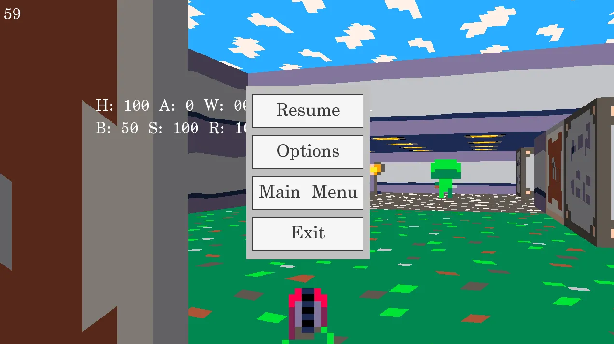

# dgm::App and App State Pattern

The App State pattern aims to help you with the separation and orchestration of application states (or screens). For example, you have a main menu state, from which you can go to game or to options. Going back from each game or options means to go to main menu. But if you go to pause menu from the game and then to options, the "back" button is supposed to take you from options back to pause menu.

When simplified, this system is just a plain old stack, similar to how functions call each other and return to the caller:

* Options (popping stack will go back to pause menu)
* Pause menu
* Game
* Main menu

Another requirement games often have is to have some states (semi)transparent. For example, you want see the game under the pause menu:



In case of multiplayer games, the game should still be updated, even when the player is in the pause menu.

The most complicated requirement is that sometimes, states need to know the context under they've been brought into focus (after the previous state was popped from the stack). From the pause menu, you either need to resume the game or to exit to the main menu. Thus, states need some sort of communication bus to convey this information.

All these requirements are covered by the `dgm::App` class and the `dgm::AppState` interface.

## dgm:App

This class instruments stack manipulation and the application loop. To construct the `dgm::App` object, you need to have an initialized `dgm::Window` object, then push some initial state to it and then execute the main loop:

```cpp
auto&& window = dgm::Window({1280, 720}, "Demo");
auto&& app = dgm::App(window);
app.pushState<MainMenuState>(params...); // works same as emplace on std::vector
app.run(); // will not return until there are states on stack
```

The `dgm::App` object exposes following interface that can be used by the underlying states:

 * pushState - Create new application state (enter pause menu from game)
 * popState - Currently simulated state exits itself (pops itself from the stack) with an optional message
 * exit - Exit the application - `dgm::App::run` will return

## dgm::AppState

The more interesting stuff happens in the `dgm::AppState` interface. Let's look at an example implementation:

```cpp
class MainMenuState final : public dgm::AppState {
public:
	MainMenuState(dgm::App& app, other_params...)
	: dgm::AppState(app, dgm::AppStateConfig {
		.clearColor = sf::Color::White,
		.shouldUpdateUnderlyingState = false,
		.shouldDrawUnderlyingState = true
	}) { /* ... */ }

public:
	void input() override {}
	void update() overide {}
	void draw() override {}

private:
	void loseFocusImpl() {}
	void restoreFocusImpl(const std::string& message) {}
};
```

Each derived state needs to to accept `dgm::App&` as its first constructor parameter and this `dgm::App` parameter needs to be passed down to `dgm::AppState` constructor. You can then safely refer to the `app` member variable, which exposes the `dgm::App` interface and two public member variables `time` and `window`.

The `dgm::AppStateConfig` could be defaulted or configured as you need. The `clearColor` is the color passed to the `dgm::Window::beginDraw` function. `shouldUpdateUnderlyingState` tells the engine to run `input` and `update` methods on the underlying state (and if the underlying state also sets this flag, it will simulate the state under it, etc). `shouldDrawUnderlyingState` does the same for the `draw` method.

`input` and `update` methods are separated for the sake of clean code. You should use `input` method to handle `sf::Event`s and update to do everything else. `draw` method is used for rendering. `dgm::Window::beginDraw` is called for you before this method is executed and `dgm::Window::endDraw` is called automatically afterwards.

`loseFocusImpl` is called when this state is on the top of the stack and another state is pushed atop of it. `restoreFocusImpl` is called when this state becomes a top state once again. Since states can still be simulated even when they are not on the top, you can use member variable `hasFocus` to determine whether the particular state is currently the top one.

### Communication bus

The `dgm::App::popState` accepts an optional string message as a parameter. This message is then passed to the `dgm::AppState::restoreFocusImpl` method. Thus, the current top state can exit itself by calling `popState` and then state under it that will be brought into the focus can then decide whether it wants to pop itself (or immediately push a new state) based on the signalled message.

Furthermore, a state that is simulated, but not the top one, can call the `popState` as well. This can possibly happen in a multiplayer game - you are in the pause menu to adjust some options, but the game finishes in the meantime or server loses connectivity. In that case, you possibly want to just abruptly exit to the main menu. Thus, the game loop detects some network event and forcefully pops whatever is the top state right at the moment, with the message that will ensure that all states subsequent states will pop themselves as well.

The implementation of the message system is completely up to you. Since C++ cannot do templated virtual methods, string parameter seemed like a good call to convey the message without enforcing a particular communication framework.

Calling `popState` multiple times in a single frame or intermixing `exit` and `popState` calls is considered to be a bug. This will throw an assertion in Debug build. In Release build, each call overwrites the previous one. I am still on a fence whether this should be considered a hard error or what should be the most convenient. The implementation might change in the future.

Last thing to note is that pop is scheduled to happen at the end of the frame (after the `draw` method and before the `input` method). Calling `popState` from within `restoreFocusImpl` will schedule the pop right after the `restoreFocusImpl` finishes.